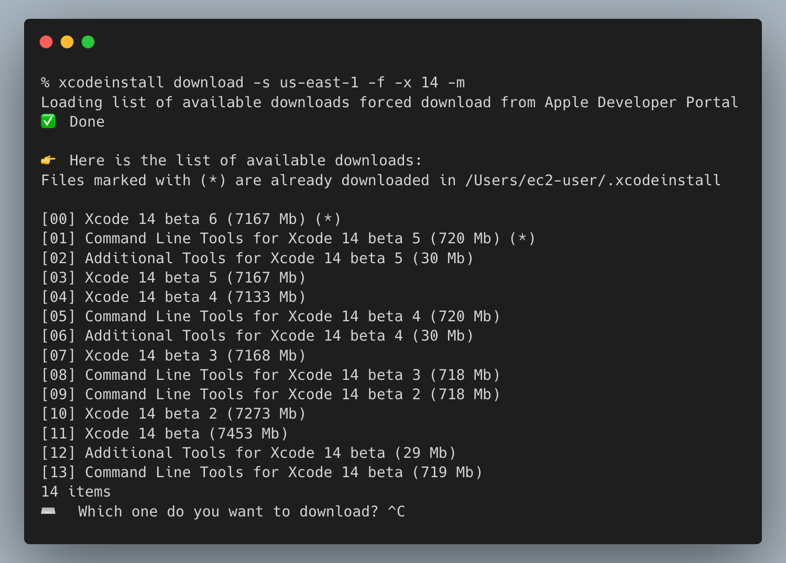
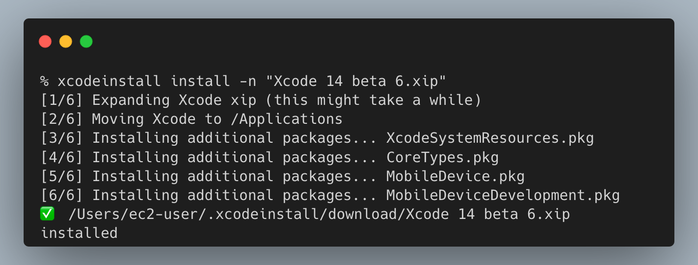
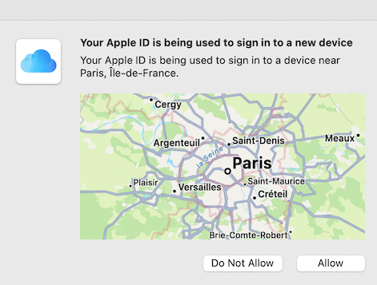
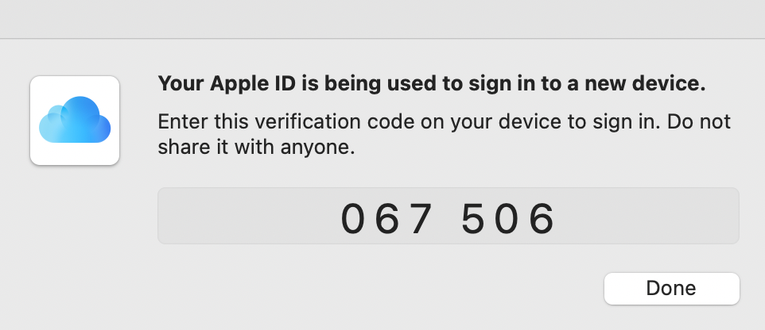

[](https://github.com/sebsto/xcodeinstall/actions/workflows/build_and_test.yml)

[](https://github.com/sebsto/xcodeinstall/actions/workflows/build_and_test_gh_hosted.yml)


[](LICENSE)

This is a command line utility to download and install Xcode in headless mode (from a Terminal only).

## TL;DR




## What is it

`xcodeinstall` is a command line utility to download and install Xcode from the terminal only. It works both interactively and unattended:

- **Interactive mode**: Prompts you for your Apple Developer account username, password, and MFA code
- **Unattended mode**: Fetches your Apple Developer credentials from AWS Secrets Manager

### Key Features

✅ **Automated Downloads**: Download any Xcode version from Apple Developer Portal
✅ **Headless Installation**: Install Xcode without GUI interaction
✅ **AWS Secrets Manager Integration**: Securely store credentials and session tokens in the cloud
✅ **Persistent Configuration**: Automatically saves AWS region and profile settings after first use
✅ **Multi-Machine Support**: Share authentication sessions between your laptop and cloud machines
✅ **MFA Support**: Works with Apple's two-factor authentication (requires manual code entry)

### How It Works

**Authentication Flow:**
1. When **MFA is configured** on your Apple Developer account (highly recommended), you must manually enter the MFA code sent to your device. This step cannot be automated for security reasons.

2. Your Apple Developer Portal **username and password are NEVER stored** on disk. They are only used to authenticate with Apple's API and obtain a session token.

3. The **session token is stored** either locally in `~/.xcodeinstall/` or on AWS Secrets Manager (your choice).

4. Sessions typically remain valid for several days or weeks. When expired, re-authentication is required. Apple may also prompt for re-authentication when connecting from a new IP address or location.

**AWS Secrets Manager Benefits:**
- **Secure storage**: Credentials and session tokens stored in AWS cloud
- **Multi-machine access**: Authenticate on your laptop, use the session on EC2 instances
- **Automatic configuration**: Region and profile settings saved after first use

> **Important**: When using AWS Secrets Manager, you must use the same AWS region and profile for all commands (`authenticate`, `list`, `download`). The tool automatically saves these settings after your first authentication.

## Demo 


## Why install Xcode in headless mode?

When preparing a macOS machine in the cloud for CI/CD, you don't always have access to the login screen, or you don't want to access it.

It is a best practice to automate the preparation of your build environment to ensure they are always identical.

## How to install 

Most of you are not interest by the source code. To install the brinary, use [homebrew](https://brew.sh) package manager and install a custom tap, then install the package. 

First, install the custom tap. This is a one-time operation.

```zsh
➜  ~ brew tap sebsto/macos

==> Tapping sebsto/macos
Cloning into '/opt/homebrew/Library/Taps/sebsto/homebrew-macos'...
remote: Enumerating objects: 6, done.
remote: Counting objects: 100% (6/6), done.
remote: Compressing objects: 100% (5/5), done.
remote: Total 6 (delta 0), reused 0 (delta 0), pack-reused 0
Receiving objects: 100% (6/6), 5.55 KiB | 5.55 MiB/s, done.
Tapped 1 formula (13 files, 21.7KB).
```

Once the tap is added, install the package by typing `brew install xcodeinstall`

```zsh
➜  ~ brew install xcodeinstall 

==> Downloading https://github.com/sebsto/xcodeinstall/archive/refs/tags/v0.1.tar.gz
Already downloaded: /Users/stormacq/Library/Caches/Homebrew/downloads/03a2cadcdf453516415f70a35b054cdcfb33bd3a2578ab43f8b07850b49eb19c--xcodeinstall-0.1.tar.gz
==> Installing xcodeinstall from sebsto/macos
🍺  /opt/homebrew/Cellar/xcodeinstall/0.2: 8 files, 25.6MB, built in 2 seconds
==> Running `brew cleanup xcodeinstall`...
```

Once installed, it is in the path, you can just type `xcodeinstall` to start the tool.

## How to use

### Quick Start for First-Time Users

The typical workflow is:

1. **Authenticate** - Sign in to Apple Developer Portal (one time)
2. **List** - Browse available Xcode versions
3. **Download** - Download your desired Xcode version
4. **Install** - Install the downloaded Xcode

```bash
# Step 1: Authenticate (prompts for Apple ID and password)
xcodeinstall authenticate

# Step 2: List available Xcode versions
xcodeinstall list --only-xcode

# Step 3: Download a specific version (prompts if --name is omitted)
xcodeinstall download --name "Xcode 15.2.xip"

# Step 4: Install the downloaded version
xcodeinstall install --name "Xcode 15.2.xip"
```

**Using AWS Secrets Manager?** Add `-s <region>` and `-p <profile>` flags to the authenticate command. These settings are **automatically saved** and reused for subsequent commands. See [AWS Secrets Manager](#using-aws-secrets-manager-1) section below.

### Overview

```
➜  ~ xcodeinstall

OVERVIEW: A utility to download and install Xcode

USAGE: xcodeinstall [--verbose] <subcommand>

OPTIONS:
  -v, --verbose           Produce verbose output for debugging
  --version               Show the version.
  -h, --help              Show help information.

SUBCOMMANDS:
  authenticate            Authenticate yourself against Apple Developer Portal
  signout                 Signout from Apple Developer Portal
  list                    List available versions of Xcode and development tools
  download                Download the specified version of Xcode
  install                 Install a specific XCode version or addon package
  storesecrets            Store Apple Developer credentials in AWS Secrets Manager

  See 'xcodeinstall help <subcommand>' for detailed help.
```

### Persistent Configuration

When using AWS Secrets Manager, `xcodeinstall` **automatically saves** your `-s` (AWS region) and `-p` (AWS profile) settings to `~/.xcodeinstall/config.json`.

**First time:** Specify the options explicitly:
```bash
xcodeinstall authenticate -s us-west-2 -p myprofile
```

**Subsequent commands:** Options are loaded automatically:
```bash
xcodeinstall list
# Info: Using saved settings: -s us-west-2 -p myprofile
```

**Override saved settings:** Command-line arguments always take precedence:
```bash
xcodeinstall list -s us-east-1
# Info: Using saved settings: -p myprofile
# Uses: us-east-1 (overridden) + myprofile (saved)
```

**Partial updates:** Specifying only one option preserves the other:
```bash
xcodeinstall authenticate -p newprofile
# Keeps saved region, updates profile
```

This eliminates repetitive typing of `-s` and `-p` flags while maintaining full control through command-line overrides.

### Authentication

```
➜  ~ xcodeinstall authenticate -h

OVERVIEW: Authenticate yourself against Apple Developer Portal

USAGE: xcodeinstall authenticate [--verbose] [-s <region>] [-p <profile>]

OPTIONS:
  -v, --verbose           Produce verbose output for debugging
  -s, --secretmanager-region <secretmanager-region>
                          Instructs to use AWS Secrets Manager to store and read secrets in the given AWS Region
  -p, --profile <profile> The AWS profile name to use for authentication (from ~/.aws/credentials and ~/.aws/config)
  --version               Show the version.
  -h, --help              Show help information.
```

#### Interactive Authentication (Local Storage)

For local development or testing, authenticate without AWS Secrets Manager:

```bash
➜  ~ xcodeinstall authenticate

⚠️⚠️⚠️
This tool prompts you for your Apple ID username, password, and two factors authentication code.
These values are not stored anywhere. They are used to get an Apple session ID.

The Session ID is stored locally in ~/.xcodeinstall/

⌨️  Enter your Apple ID username: <your apple id email>
⌨️  Enter your Apple ID password:
Authenticating...
🔐 Two factors authentication is enabled, enter your 2FA code: 000000
✅ Authenticated with MFA.
```

#### Using AWS Secrets Manager

For production, CI/CD, or multi-machine setups, use AWS Secrets Manager to store credentials and session tokens securely:

```bash
➜  ~ xcodeinstall authenticate -s us-west-2 -p myprofile

Retrieving Apple Developer Portal credentials...
Authenticating...
🔐 Two factors authentication is enabled, enter your 2FA code: 000000
✅ Authenticated with MFA.
```

**Important:** The `-s` (region) and `-p` (profile) options are **automatically saved** to `~/.xcodeinstall/config.json` for subsequent commands. You only need to specify them once.

> **Note:** When using Secrets Manager, you must use the **same AWS region and profile** for all commands (`authenticate`, `list`, `download`). The saved configuration ensures consistency across commands.

The two authentication methods (interactive and AWS Secrets Manager based) trigger the following prompt on your registered devices (laptop, phone, or tablet):





### List Files Available to Download

```bash
➜  ~ xcodeinstall list -h
OVERVIEW: List available versions of Xcode and development tools

USAGE: xcodeinstall list [--verbose] [--force] [--only-xcode] [--xcode-version <xcode-version>] [--most-recent-first] [--date-published] [-s <region>] [-p <profile>]

OPTIONS:
  -v, --verbose           Produce verbose output for debugging
  -f, --force             Force to download the list from Apple Developer Portal, even if we have it in the cache
  -o, --only-xcode        Filter on Xcode package only
  -x, --xcode-version <xcode-version>
                          Filter on provided Xcode version number (default: 13)
  -m, --most-recent-first Sort by most recent releases first
  -d, --date-published    Show publication date
  -s, --secretmanager-region <secretmanager-region>
                          Instructs to use AWS Secrets Manager to store and read secrets in the given AWS Region
  -p, --profile <profile> The AWS profile name to use for authentication
  --version               Show the version.
  -h, --help              Show help information.
```

**Examples:**

```bash
# List all available downloads
xcodeinstall list

# List only Xcode packages, most recent first
xcodeinstall list --only-xcode --most-recent-first

# Filter by Xcode version 15
xcodeinstall list --only-xcode --xcode-version 15

# With AWS Secrets Manager (uses saved settings if available)
xcodeinstall list
# Info: Using saved settings: -s us-west-2 -p myprofile
```

### Download File

```bash
➜  ~ xcodeinstall download -h
OVERVIEW: Download the specified version of Xcode

USAGE: xcodeinstall download [--verbose] [--force] [--only-xcode] [--xcode-version <xcode-version>] [--most-recent-first] [--date-published] [--name <name>] [-s <region>] [-p <profile>]

OPTIONS:
  -v, --verbose           Produce verbose output for debugging
  -f, --force             Force to download the list from Apple Developer Portal, even if we have it in the cache
  -o, --only-xcode        Filter on Xcode package only
  -x, --xcode-version <xcode-version>
                          Filter on provided Xcode version number (default: 13)
  -m, --most-recent-first Sort by most recent releases first
  -d, --date-published    Show publication date
  -n, --name <name>       The exact package name to download. When omitted, it prompts interactively
  -s, --secretmanager-region <secretmanager-region>
                          Instructs to use AWS Secrets Manager to store and read secrets in the given AWS Region
  -p, --profile <profile> The AWS profile name to use for authentication
  --version               Show the version.
  -h, --help              Show help information.
```

**Examples:**

```bash
# Interactive mode - prompts for file selection
xcodeinstall download --only-xcode

# Specify exact file name (useful for automation)
xcodeinstall download --name "Xcode 15.2.xip"

# With AWS Secrets Manager (uses saved settings if available)
xcodeinstall download --name "Xcode 15.2.xip"
# Info: Using saved settings: -s us-west-2 -p myprofile
```

Downloads are stored in `~/.xcodeinstall/download/`

### Install File

This command uses `sudo` to install packages. For unattended installations, configure your user account to run `sudo` without a password prompt:

```bash
# Create a sudoers file for your user
➜  ~ cat /etc/sudoers.d/your_user_id
# Give your_user_id sudo access
your_user_id ALL=(ALL) NOPASSWD:ALL
```

**Command Help:**

```bash
➜  ~ xcodeinstall install -h
OVERVIEW: Install a specific XCode version or addon package

USAGE: xcodeinstall install [--verbose] [--name <name>]

OPTIONS:
  -v, --verbose           Produce verbose output for debugging
  -n, --name <name>       The exact package name to install. When omitted, it prompts interactively
  --version               Show the version.
  -h, --help              Show help information.
```

**Examples:**

```bash
# Interactive mode - lists downloaded files and prompts for selection
xcodeinstall install

# Specify exact file name (useful for automation)
xcodeinstall install --name "Xcode 15.2.xip"
```

The installation process:
1. Extracts the `.xip` file (this takes several minutes)
2. Moves `Xcode.app` to `/Applications/`
3. Runs `xcode-select --install` to register the new Xcode version

## Minimum IAM Permissions required to use AWS Secrets Manager 

The minimum IAM permisions required to use this tool with AWS Secrets Manager is as below (do not forget to replace 000000000000 with your AWS Account ID)

```json
{
    "Version": "2012-10-17",
    "Statement": [
        {
            "Sid": "xcodeinstall",
            "Effect": "Allow",
            "Action": [
                "secretsmanager:CreateSecret",
                "secretsmanager:GetSecretValue",
                "secretsmanager:PutSecretValue"
            ],
            "Resource": "arn:aws:secretsmanager:*:000000000000:secret:xcodeinstall-*"
        }
    ]
}
```

Once associated with an IAM Role, you can attach the role to any IAM principal : user, group or an AWS service, such as an EC2 Mac instance. Here are instructions to do so.

 *Create* an IAM role that contains the minimum set of permissions to allow `xcodeinstall` to interact with AWS Secrets Manager, then *attach* this role to the EC2 Mac instance where you run `xcodeinstall`. 

From a machine where the AWS CLI is installed and where you have AWS credentials allowing you to create roles and permissions (typically your laptop), type the following commands :


1. First create a role that can be attached (trusted) by any EC2 instances:

```zsh
# Create the trust policy file 
cat << EOF > ec2-role-trust-policy.json
{
  "Version": "2012-10-17",
  "Statement": [
    {
      "Effect": "Allow",
      "Principal": { "Service": "ec2.amazonaws.com"},
      "Action": "sts:AssumeRole"
    }
  ]
}
EOF

# Create the role itself (with no permission at the moment)
aws iam create-role \
    --role-name xcodeinstall \
    --assume-role-policy-document file://ec2-role-trust-policy.json
```

2. Second, create a policy that contains the minimum set of permissions to interact with AWS Secrets Manager 

```zsh 
# Create the policy file with the set of permissions
# CHANGE 000000000000 with your AWS Account ID
cat << EOF > ec2-policy.json 
{
    "Version": "2012-10-17",
    "Statement": [
        {
            "Sid": "xcodeinstall",
            "Effect": "Allow",
            "Action": [
                "secretsmanager:CreateSecret",
                "secretsmanager:GetSecretValue",
                "secretsmanager:PutSecretValue"
            ],
            "Resource": "arn:aws:secretsmanager:*:000000000000:secret:xcodeinstall-*"
        }
    ]
}
EOF

# Create the policy 
aws iam create-policy                      \
    --policy-name xcodeinstall-permissions \
    --policy-document file://ec2-policy.json
```

3. Third, attach the policy to the role 

```zsh
# Attach a policy to a role 
# CHANGE 000000000000 with your AWS Account ID
aws iam attach-role-policy                                                     \
     --policy-arn arn:aws:iam::000000000000:policy/xcodeinstall-permissions    \
     --role-name xcodeinstall
```

4. Fourth, attach the role to your EC2 Mac instance (through an instance profile)

```zsh
# Create an instance profile 
aws iam create-instance-profile                   \
     --instance-profile-name xcodeinstall-profile

# Attach the role to the profile
aws iam add-role-to-instance-profile             \
    --instance-profile-name xcodeinstall-profile \
    --role-name xcodeinstall   

# Identify the Instance ID of your EC2 Mac Instance.
# You may use the AWS Console or search by tags like this (replace the tag value with yours)
INSTANCE_ID=$(aws ec2 describe-instances                                                 \
               --filter "Name=tag:Name,Values=M1 Monterey"                               \
               --query "Reservations[].Instances[?State.Name == 'running'].InstanceId[]" \
               --output text)

# verify you have an ID (you may add --region to target the correct AWS Region)
echo $INSTANCE_ID

# Associate the profile to the instance 
aws ec2 associate-iam-instance-profile \
    --instance-id $INSTANCE_ID         \
    --iam-instance-profile Name="xcodeinstall-profile"
```

When you start other EC2 Mac instance, you just need to attach the profile to the new instance.  The Policy and Role can be reused for multiple EC2 instances.

## How to Store Your Secrets on AWS Secrets Manager

When using AWS Secrets Manager to store your Apple Developer Portal credentials, you need to create a secret in the following format:

- **Secret name:** `xcodeinstall-apple-credentials`
- **Secret format:** JSON with username and password:

```json
{"username":"your_username","password":"your_password"}
```

### Using the `storesecrets` Command

The easiest way to create this secret is using the built-in `storesecrets` command:

```bash
➜  ~ xcodeinstall storesecrets -s us-west-2 -p myprofile

This command captures your Apple ID username and password and stores them securely in AWS Secrets Manager.
It allows this command to authenticate automatically, as long as no MFA is prompted.

⌨️  Enter your Apple ID username: your.email@example.com
⌨️  Enter your Apple ID password:
✅ Credentials are securely stored
```

**Options:**
- `-s, --secretmanager-region`: AWS region where the secret will be stored (choose a region close to you for lower latency)
- `-p, --profile`: AWS profile name to use (from `~/.aws/credentials` and `~/.aws/config`)

**Important:** Unlike other commands, `storesecrets` requires you to specify `-s` and `-p` every time, as it's typically a one-time setup operation.

### After Storing Credentials

Once credentials are stored in AWS Secrets Manager:

1. Authenticate once with the same region and profile:
   ```bash
   xcodeinstall authenticate -s us-west-2 -p myprofile
   ```

2. The region and profile are saved automatically. Subsequent commands work without flags:
   ```bash
   xcodeinstall list
   xcodeinstall download --name "Xcode 15.2.xip"
   ```

## Troubleshooting

### Configuration Files and Data Locations

`xcodeinstall` stores its files in `~/.xcodeinstall/`:

```bash
~/.xcodeinstall/
├── config.json           # Saved AWS region and profile settings
├── downloadList          # Cached list of available downloads
└── download/             # Downloaded Xcode files
```

### Managing Saved Settings

**View saved settings:**
```bash
cat ~/.xcodeinstall/config.json
```

**Clear saved settings:**
```bash
rm ~/.xcodeinstall/config.json
```

After clearing, you'll need to specify `-s` and `-p` flags again on your next command.

**Reset everything (including downloads and cache):**
```bash
rm -rf ~/.xcodeinstall/
```

### Common Issues

**"Using saved settings" message appears with wrong region/profile:**
- Override with command-line flags: `xcodeinstall list -s us-east-1 -p newprofile`
- Or clear the config file: `rm ~/.xcodeinstall/config.json`

**Session expired errors:**
- Run `xcodeinstall authenticate` (with `-s` and `-p` if using AWS Secrets Manager)
- Enter your MFA code when prompted

**AWS credentials not found:**
- Ensure your AWS credentials are configured in `~/.aws/credentials` or via IAM instance profile
- Check that the profile name matches what you specified with `-p`

**Permission denied when installing:**
- Configure passwordless `sudo` (see [Install File](#install-file) section)
- Or run with `sudo` when prompted

## How to Contribute

I welcome all types of contributions, not only code: testing and creating bug reports, documentation, tutorials, etc.
If you are not sure how to get started or how to be useful, contact me at stormacq@amazon.com

I listed a couple of ideas below.

## List of Ideas

**UX Improvements:**
- Manage multiple versions of Xcode (rename `Xcode.app` to `Xcode-version.app` and use symlinks)
- Download the latest Xcode version by default
- Capture stderr and stdout of subprocess to emit on the logger

**AWS Integration:**
- Add possibility to emit SNS notifications on errors (e.g., Session Expired)
- Support for additional AWS authentication methods (SSO, OIDC)

**Configuration Management:**
- Add explicit config management commands (`config show`, `config clear`)
- Support for multiple named profiles (`--save-as dev`, `--use-profile dev`)
- Environment variable fallback (`XCODEINSTALL_REGION`, `XCODEINSTALL_PROFILE`)

**Completed:**
- [x] Clean room implementation of progress bar to remove dependency on Swift Tools Core library
- [x] Persistent configuration for `-s` and `-p` options 

## Credits 

[xcode-install](https://github.com/xcpretty/xcode-install) and [fastlane/spaceship](https://github.com/fastlane/fastlane/tree/master/spaceship) both deserve credit for figuring out the hard parts of what makes this possible.
